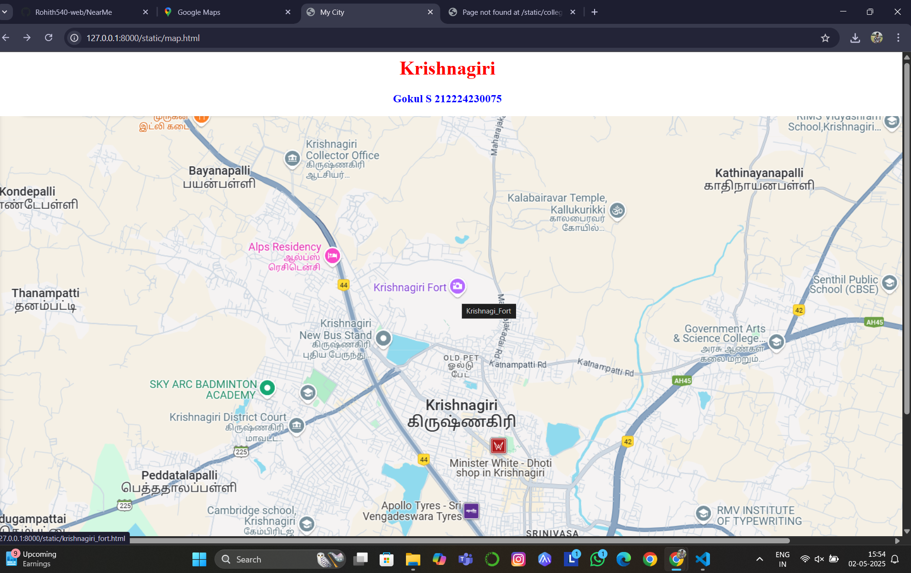
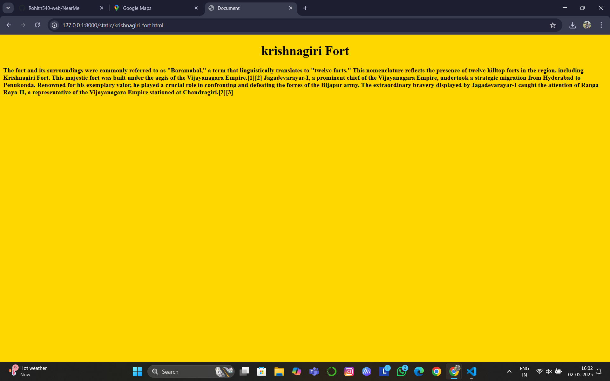
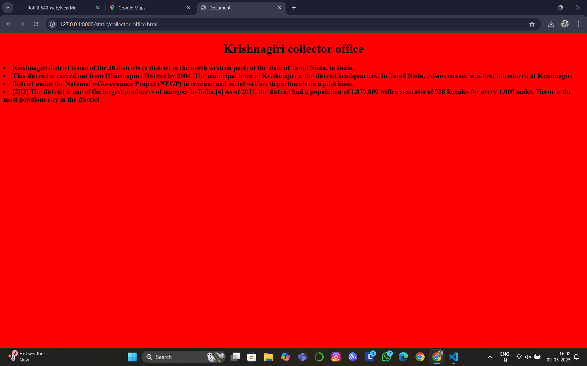
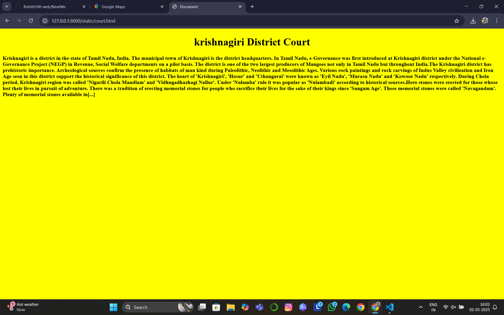

# Ex04 Places Around Me
## Date: 02.05.2025

## AIM
To develop a website to display details about the places around my house.

## DESIGN STEPS

### STEP 1
Create a Django admin interface.

### STEP 2
Download your city map from Google.

### STEP 3
Using ```<map>``` tag name the map.

### STEP 4
Create clickable regions in the image using ```<area>``` tag.

### STEP 5
Write HTML programs for all the regions identified.

### STEP 6
Execute the programs and publish them.

## CODE

### map.html
```

<html>
<head><title>My City</title></head>
<body>
<h1 align="center">
<font color="red" ><b align="center">Krishnagiri</b></font>
</h1>
<h3 align="center">
<font color="blue"><b>Gokul S 212224230075</b></font>
</h3>
<center>


<map name="image-map">
    <area target="" alt="Krishnagi_Fort" title="Krishnagi_Fort" href="krishnagiri_fort.html" coords="750,200,1030,388" shape="rect">
    <area target="" alt="Collector_Office" title="Collector_Office" href="collector_office.html" coords="450,57,677,134" shape="rect">
    <area target="" alt="Goverment_college" title="Goverment_college" href="college.html" coords="1000,300,1484,457" shape="rect">
    <area target="" alt="Bus_Stand" title="Bus_Stand" href="bus_stand.html" coords="600,300,1030,388" shape="rect">
    <area target="" alt="District_Court" title="District_Court" href="court.html" coords="450,600,1030,388" shape="rect">
</map>
</center>
</body>
</html>
```
### bus_stand.html

```
<!DOCTYPE html>
<html lang="en">
<head>
    <meta charset="UTF-8">
    <meta name="viewport" content="width=device-width, initial-scale=1.0">
    <title>Document</title>
</head>
<body bgcolor="pink">
    <h1 align="center">Bus_Stand</h1>
    <p><b>The Krishnagiri New Bus Stand in Tamil Nadu, India is located near a lake and mountains, offering a scenic view. Some say the area is beautiful and natural.
    </b></p>
</body>
</html>

```

### collector_office.html

```

<!DOCTYPE html>
<html lang="en">
<head>
    <meta charset="UTF-8">
    <meta name="viewport" content="width=device-width, initial-scale=1.0">
    <title>Document</title>
</head>
<body  bgcolor="red">
    <h1 align="center"> Krishnagiri collector office</h1>
    <h2 style="font-size: large;"><li>Krishnagiri district is one of the 38 districts (a district in the north western part) of the state of Tamil Nadu, in India. <br> <li>This district is carved out from Dharmapuri District by 2004. The municipal town of Krishnagiri is the district headquarters. In Tamil Nadu, e-Governance was first introduced at Krishnagiri <br><li>district under the National e-Governance Project (NEGP) in revenue and social welfare departments on a pilot basis. <br> <li>[2][3] The district is one of the largest producers of mangoes in India.[4] As of 2011, the district had a population of 1,879,809 with a sex-ratio of 958 females for every 1,000 males. Hosur is the most populous city in the district</h2>
</body>
</html>

```

### college.html

```
<!DOCTYPE html>
<html lang="en">
<head>
    <meta charset="UTF-8">
    <meta name="viewport" content="width=device-width, initial-scale=1.0">
    <title>Document</title>
</head>
<body bgcolor="cyan">
    <h1 align="center">Goverment_college</h1>
    <p><b>Krishnagar Government College is the oldest college of the district. In 1846 Lord Hardinge approved the establishment proposal of the college. Nadia Raj Srishchandra Roy and Maharani Swarnamoyee Devi from Cossimbazar estate donated the land for it. The palatial building was made in 1856. The first principal was David Lester Richardson, famous educationist, ex-principal of the Presidency College, Calcutta. After that Marcus Gustavus Rochfort, Loper Lethbridge, Umesh Chandra Dutta, Jyoti Bhusan Bhadury, R.N Gilcriest, Eagerton Smith, Rakhalraj Biswas, and Satish Chandra De glorified the post. Notable personalities of the national freedom struggle, activists of political and social movements, academics, and intellectuals came out from the college. Ramtanu Lahiri, Md. Abdul Hai, Bishnu Dey, Subodh Chandra Sengupta, Khudiram Das, Sudhir Chakravarti were among the notable faculty members of the college.[5]</b></p>
</body>
</html>
```

### court.html

```
<!DOCTYPE html>
<html lang="en">
<head>
    <meta charset="UTF-8">
    <meta name="viewport" content="width=device-width, initial-scale=1.0">
    <title>Document</title>
</head>
<body bgcolor="yellow">
    <h1 align="center">krishnagiri District Court</h1>
    <p><b>Krishnagiri is a district in the state of Tamil Nadu, India. The municipal town of Krishnagiri is the district headquarters. In Tamil Nadu, e-Governance was first introduced at Krishnagiri district under the National e-Governance Project (NEGP) in Revenue, Social Welfare departments on a pilot basis. The district is one of the two largest producers of Mangoes not only in Tamil Nadu but throughout India.The Krishnagiri district has prehistoric importance. Archeological sources confirm the presence of habitats of man kind during Paleolithic, Neolithic and Mesolithic Ages. Various rock paintings and rock carvings of Indus Valley civilization and Iron Age seen in this district support the historical significance of this district. The heart of 'Krishnagiri', 'Hosur' and 'Uthangarai' were known as 'Eyil Nadu', 'Murasu Nadu' and 'Kowoor Nadu' respectively. During Chola period, Krishnagiri region was called 'Nigarili Chola Mandlam' and 'Vidhugadhazhagi Nallur'. Under 'Nulamba' rule it was popular as 'Nulambadi' according to historical sources.Hero stones were erected for those whose lost their lives in pursuit of adventure. There was a tradition of erecting memorial stones for people who sacrifice their lives for the sake of their kings since 'Sangam Age'. These memorial stones were called 'Navagandam'. Plenty of memorial stones available in[...]

    </b></p>
</body>
</html>
```

### krishnagiri_fort.html

```
<!DOCTYPE html>
<html lang="en">
<head>
    <meta charset="UTF-8">
    <meta name="viewport" content="width=device-width, initial-scale=1.0">
    <title>Document</title>
</head>
<body bgcolor="gold">
    <h1 align="center">krishnagiri Fort</h1>
    <p><b>The fort and its surroundings were commonly referred to as "Baramahal," a term that linguistically translates to "twelve forts." This nomenclature reflects the presence of twelve hilltop forts in the region, including Krishnagiri Fort. This majestic fort was built under the aegis of the Vijayanagara Empire.[1][2]

        Jagadevarayar-I, a prominent chief of the Vijayanagara Empire, undertook a strategic migration from Hyderabad to Penukonda. Renowned for his exemplary valor, he played a crucial role in confronting and defeating the forces of the Bijapur army. The extraordinary bravery displayed by Jagadevarayar-I caught the attention of Ranga Raya-II, a representative of the Vijayanagara Empire stationed at Chandragiri.[2][3]</b></p>
</body>
</html>
```
## OUTPUT

Gokul S 212224230075








## RESULT
The program for implementing image maps using HTML is executed successfully.
